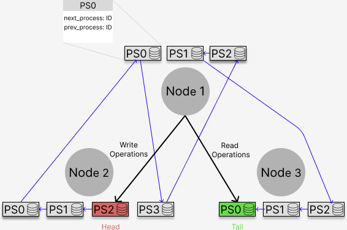

# distributed-systems-project-2
An online book shop that implements chain replication

Each computer acts as a Node.\
Each node has k processes. Processes are represented by objects. Each process has a dictionary that stores the inserted books. \
When a chain is created, each process has the value of the previous and the next processes. New data is written to the head and is passed along the chain. When the data has been written to all processes, the data will become clean. Data is read from the tail, but the head is also consulted in case the data in the tail is not up to date. \
From each node, it's possible to enter commands to modify the data in the processes, get the current status of data and remove the head of the chain. It's also possible to restore the removed head. \

The implementation of the system closely followed the project's description, meaning the PDF document explains the architecture of the implemented system quite well.

### System blueprint

